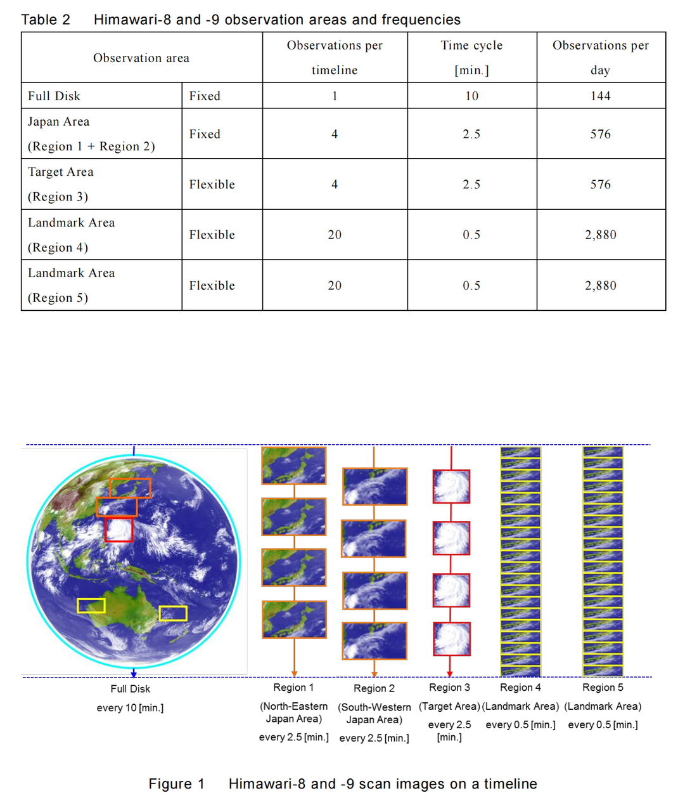
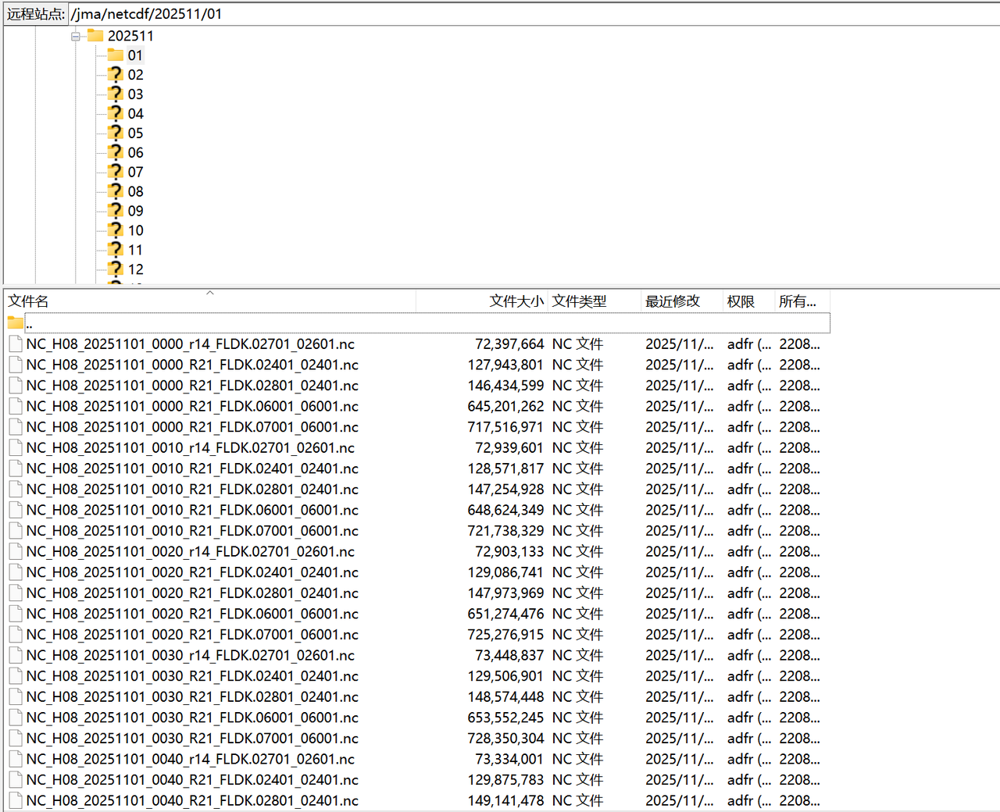
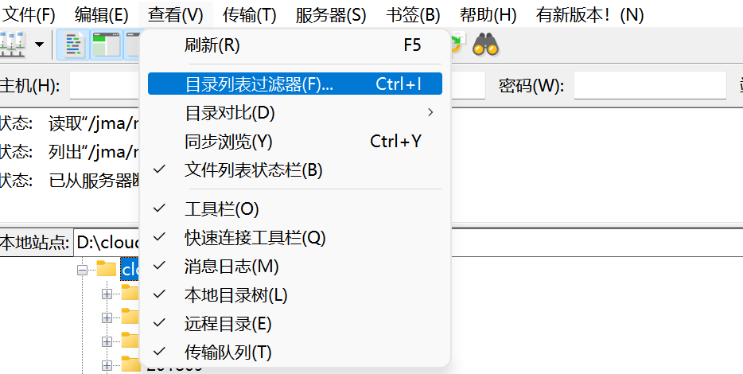
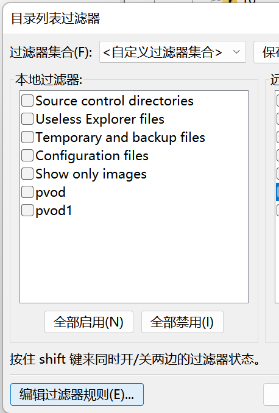
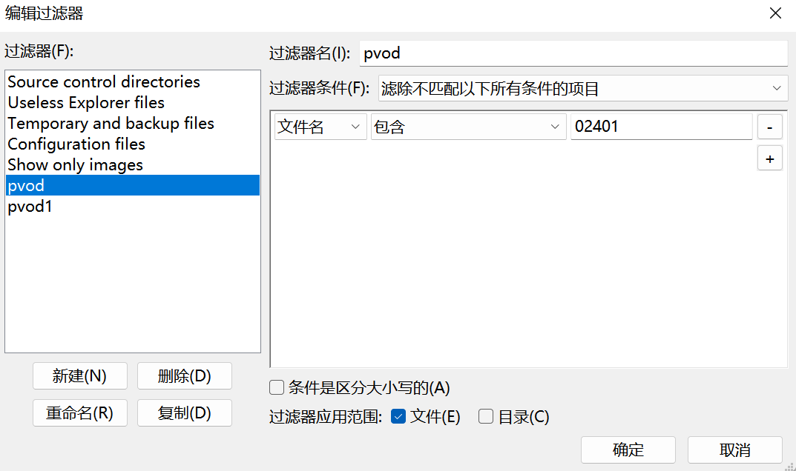
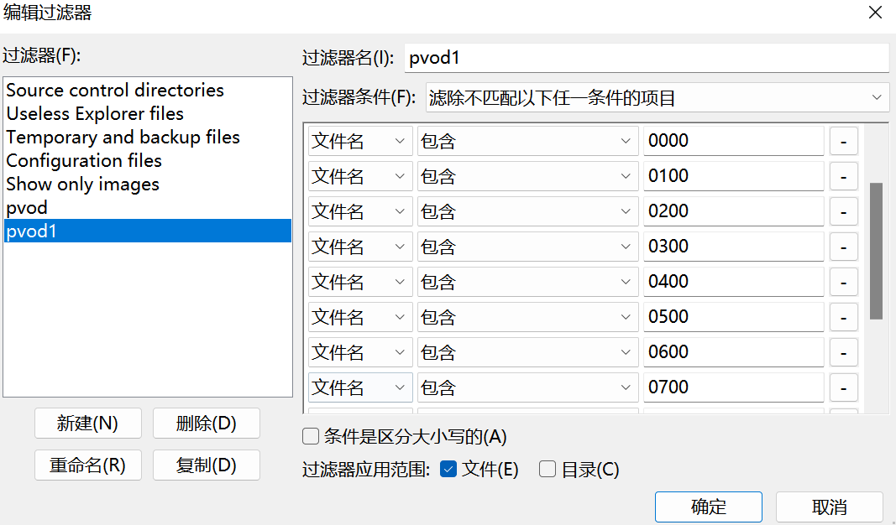
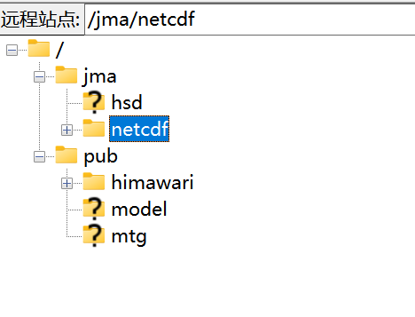

# Himawari-8 卫星数据下载（卫星云图）

## 账号开通及下载工具介绍

参考教程：[Himawari-8 数据介绍及下载方法](https://blog.csdn.net/qq_42316063/article/details/125860672)

> 需通过 [JAXA P-Tree](https://www.eorc.jaxa.jp/ptree/) 网站注册账号，审核通过后将收到 FTP 登录凭证（含地址、用户名、密码），通常需 1–3 个工作日。

推荐下载工具：
- **FileZilla**（免费开源 FTP 客户端）
- 浏览器直接访问（仅限部分公开目录）

---

## 卫星覆盖区域介绍

> Himawari-8/9 定位于东经 140.7° 的地球静止轨道，主要覆盖 **东亚、东南亚、西太平洋及澳大利亚北部**，观测范围约为 **60°S – 60°N，80°E – 200°E**。

---

## 批量下载技巧

> **注意**：下载效率主要受限于网络带宽、磁盘空间及 I/O 速度。

### 批量筛选方法

#### 1. 问题描述
原始数据按 10 分钟间隔存档，文件数量庞大。通常我们仅需特定时间、特定波段或特定分辨率的数据。

#### 2. 文件命名规则

例如：Full-disk文件命名格式如下：        
NC_Hnn_YYYYMMDD_hhmm_Rbb_FLDK.xxxxx_yyyyy.nc

各字段含义说明：

| 字段 | 说明 | 示例值 |
|------|------|--------|
| `nn` | 卫星编号 | `08`（Himawari-8），`09`（Himawari-9） |
| `YYYY` | 观测起始年份（UTC） | `2023` |
| `MM` | 月份（2 位） | `07` |
| `DD` | 日期（2 位） | `15` |
| `hh` | 小时（UTC，24 小时制） | `03` |
| `mm` | 分钟（UTC） | `00` |
| `bb` | 波段编号（01–16） | `13`（常用红外波段） |
| `xxxxx` / `yyyyy` | 图像尺寸标识（反映分辨率） | `2401`（≈5 km），`6001`（≈2 km），`12001`（≈1 km，仅 Band 3） |

✅ **示例文件名**：
- `NC_H08_20230715_0300_R13_FLDK.06001_06001.nc`  
  表示 Himawari-8 在 **2023-07-15 03:00 UTC** 获取的 **第 13 波段**（热红外），**2 km 分辨率** 的全盘数据。

#### 3. 使用 FileZilla 筛选文件

1. 连接 FTP 后，点击菜单栏：**查看 → 目录列表过滤器**

    

2. 点击 **编辑过滤器规则**

    

3. 添加自定义通配符规则（支持 `*`）：

        

   

| 需求 | 过滤规则 |      
|------|---------|      
| 仅整点数据（如 00:00, 01:00） | `*_0000_*` |     
| 仅 Band 13 数据 | `*R13*` |     
| 仅 5 km 分辨率 | `*2401*` |     
| 仅 2023 年 7 月数据 | `*202307*` |     
| 组合条件（整点 + Band 13 + 2 km） | `*2023*_0000_*R13*6001*` |      

> 💡 提示：规则区分大小写     

---
## 卫星云图提取
-  葵花8、9号卫星数据处理及可视化](https://blog.csdn.net/qq_43352337/article/details/139792080)
-  见文件image_process.py

## 注意事项

1. **时间均为 UTC（协调世界时）**  
   例如：北京时间 = UTC + 8，因此 `0000 UTC` 对应北京时间 `08:00`。

2. **典型目录结构**

---

## 附件

-  HS_D_users_guide_en_v12.pdf
-  READMEfirst_P-Ttree_en.txt
-  README_HimawariNetCDF_en.txt
